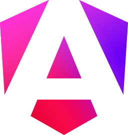
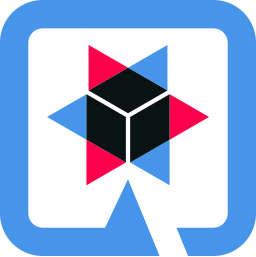

# Die Lösung: Leotickets

Hallo ich bin du

<!--
Meine Notes
-->

---
transition: slide-left
---

# Die Vision

- Für immer
- Für alle
- Für alles

---

# Technologien

<div class="flex gap-4 w-full justify-evenly h-full items-center">
  <div class="flex flex-col items-center">
    
    <p class="text-center">React</p>
  </div>
  <div class="flex flex-col items-center">
    
    <p class="text-center">Angular</p>
  </div>
  <div class="flex flex-col items-center">
    
    <p class="text-center">Quarkus</p>
  </div>
</div>

---
transition: slide-left
---

# Die Architektur

```sh
├── apps
│   ├── Client
│   │   ├── Dashboard (React-Admin-Dashboard)
│   │   │   └── ...
│   │   └── Web (Angular-Web-Frontend)
│   │       └── ...
│   └── Server (Quarkus)
│       ├── api
│       │   └── ...
│       ├── interface
│       │   └── ...
│       ├── logic
│       │   └── ...
│       └── service
│           └── ...
├── Docker (Docker-Configuration)
│   └── docker-compose.yml
├── package.json
├── packages
│   └── ...
├── README.md
└── turbo.json
```